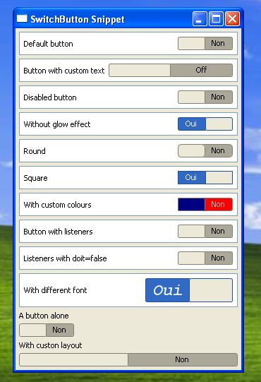
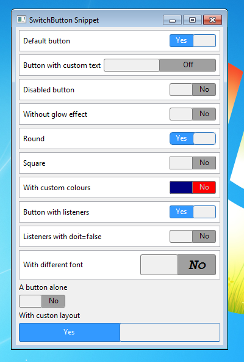
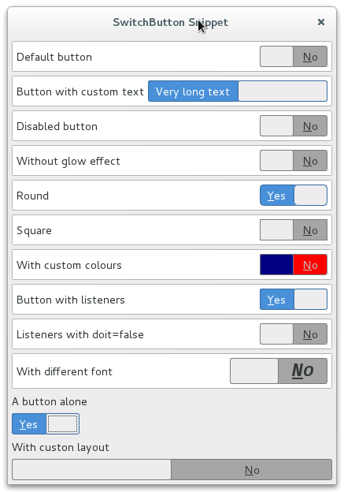

# Switch Button for SWT

Originally taken from Opal project (https://code.google.com/a/eclipselabs.org/p/opal/). This is a simplified version of the original widget.
* No more label on the right (the user is free to create a label using `Label` or `CLabel`)
* Fixes some issue with the drawing in my GTK Linux;
* Introduce keybord listener (key selection and key traversal);
* Draw the focus line when widget get focus;
* Uses JFace ressource for label (Yes, No). So translation is supported out of the box;
* Adapt it's size according to the layout.

# Preview
## Windows XP

## Windows 7

## Gnome 3

